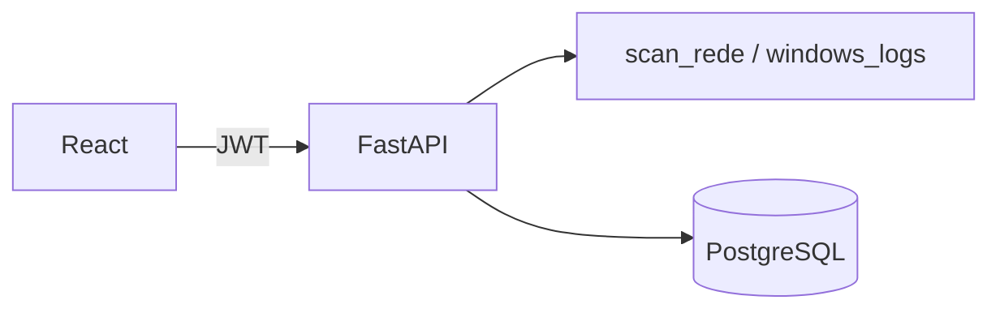
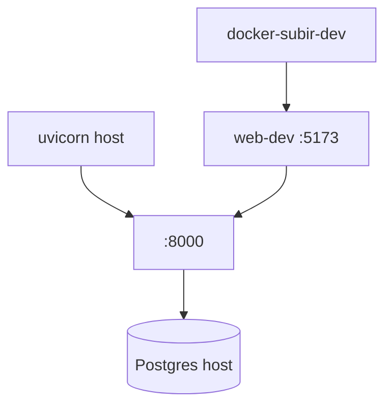
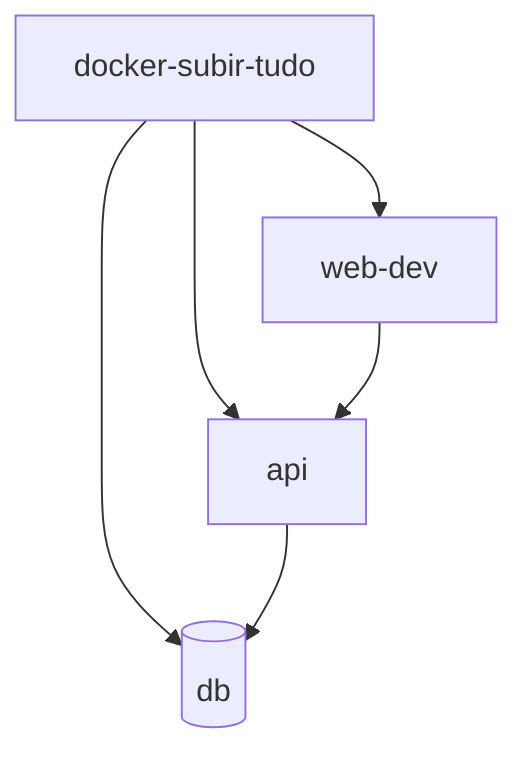
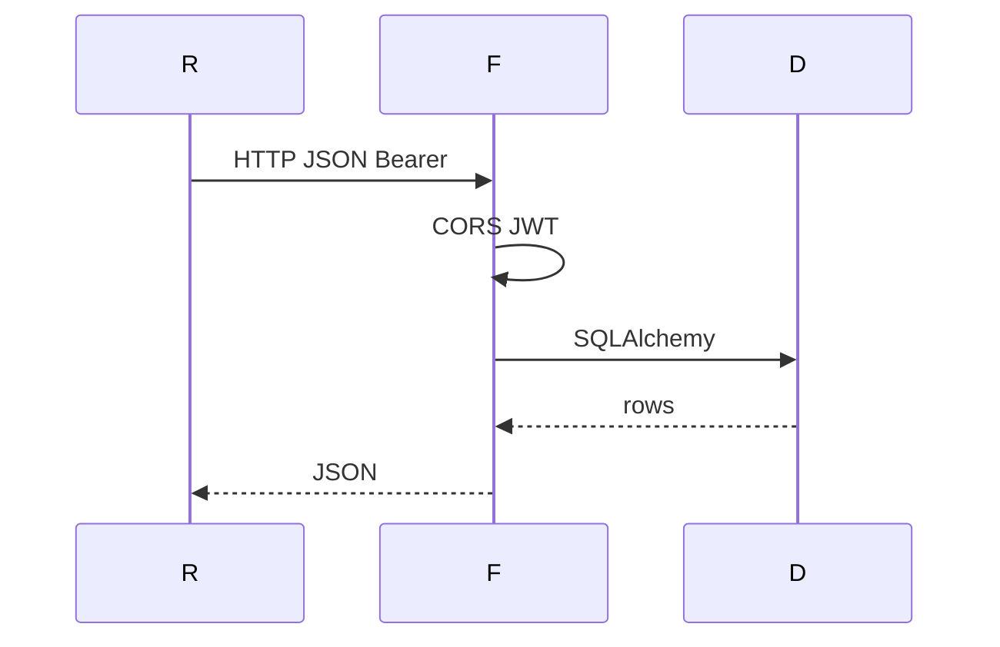
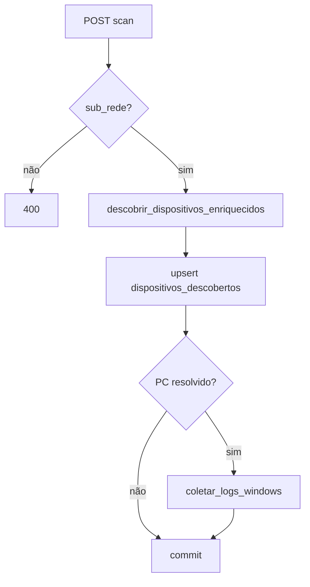

# Pipeline e fluxos — inventário IT

**Stack:** React (Vite) → FastAPI (Uvicorn) → PostgreSQL/SQLite. Scan + logs WMI correm no processo da API (ideal: API no Windows). Sem CI (`.github/workflows`). Docker extra: [`DS-11-pipeline-docker-dev/FLUXO-PIPELINE.md`](diagramas-sequencia/DS-11-pipeline-docker-dev/FLUXO-PIPELINE.md).

| Pasta | Papel |
|-------|--------|
| `frontend/` | `App.jsx` estado + `#hash`; `api.js` HTTP |
| `backend/app/core/` | `main.py`, `config.py`, JWT, `deps.py` |
| `backend/app/database/` | engine, `get_db`, `Base` |
| `backend/app/models`, `schemas`, `routes`, `services` | ORM, Pydantic, rotas, scan/logs |
| `docker-compose.yml` | perfis `dev-live`, `docker-api`, `bundled-db` |
| `scripts/*.ps1` | Compose atalhos |
| `script de rede/` | Python à parte (não ligado ao backend) |

---

## Docker

| Perfil | Serviço | Porta |
|--------|---------|-------|
| `dev-live` | `web-dev` | 5173 |
| `docker-api` | `api` | 8000 |
| `bundled-db` | `db` | 5433→5432 |

Env típicos: `DATABASE_URL`, `SECRET_KEY`, `VITE_API_BASE`.

**Recomendado:** `docker-subir-dev.ps1` → só frontend; API + Postgres no host.

**Tudo em contentor:** `docker-subir-tudo.ps1` → `web-dev` + `api` + `db`. O `DATABASE_URL` por defeito da API aponta para `host.docker.internal`; com Postgres só no Compose pode ser preciso apontar para o serviço `db`.

---

## Pedido HTTP

1. `api.js`: base = `VITE_API_BASE` / `localStorage` / `http://localhost:8000`
2. Bearer JWT se autenticado
3. FastAPI: CORS → `get_current_user` → `get_db` → rotas → JSON

**Arranque API:** `create_all` + `garantir_compatibilidade_schema_sqlite()` em `main.py`.

| Rota | Ficheiro |
|------|----------|
| `/auth` | `auth.py` |
| `/inventarios` | `inventarios.py` |
| `/computadores` | `computadores.py` |
| `/utilizadores` | `utilizadores.py` |
| `/perfis` | `perfis.py` |
| `/localizacoes` | `localizacoes.py` |
| `GET /pesquisar` | `pesquisa.py` |

---

## Login

`POST /auth/login` → token → `localStorage` + `GET /auth/me` → `loadAllData` (paralelo: inventários, PCs, users, perfis, locais, ativos-por-inventário, histórico).

Admin UI: `authz` + `/me`. Backend admin: `deps.is_admin_user`. Opcional: `INVENTARIO_ALLOW_SWAGGER_BYPASS` + `/docs`.

---

## Pós-login

`withAction` em CRUD: refetch + opcional `POST /auth/me/historico`. Dashboard: refresh silencioso 30s.

---

## Scan (`POST /inventarios/{id}/scan`)

- Só `tipo_inventario == sub_rede`
- Credenciais no body = **rede Windows**, não login da app
- IPs ausentes no scan → dispositivos descobertos `inativo`

---

## Outros

- Pesquisa: `GET /pesquisar?pesquisa=`
- Excel: `xlsx` + `exportInventarioComputadores.js`
